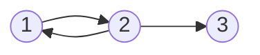

# 6. 图

## 图的基本概念

### 图的定义

图 G 由顶点集 V 和边集 E 组成，记为 G = (V, E)，其中 V(G) 表示图 G 中顶点的有限非空集；E(G) 表示图 G 中顶点之间的关系（边）集合。若 $V = \set{v_1, v_2, \cdots, v_n}$，则用 |V| 表示图 G 中顶点的个数，$E = \set{(u, v) | u \in V, v \in V}$，用 |E| 表示图 G 中边的条数。

:heavy_exclamation_mark: 线性表可以是空表，树可以是空树，但图不能是空图。至少有1个顶点，边可以为空。顶点集一定非空，边集可以为空。

#### 有向图

若 E 是有向边（也称**弧**）的有限集合时，则图 G 为有向图。弧是顶点的有序对，记为 `<v, w>`，其中 v, w 是顶点，v 称为弧尾，w 称为弧头，`<v, w>`称为从 v 到 w 的弧，也称 v 邻接到 w。

此图可表示为
$$
G_2 = (V_1, E_1) \\
V_1 = \set{1, 2, 3} \\
E_1 = \set{<1, 2>, <2, 1>, <2, 3>}
$$

#### 无向图

若 E 是无向边（简称边）的有限集合时，则图 G 为无向图。边是顶点的无序对，记为 `(v, w)`或`(w, v)`。可以说 w 和 v 互为邻接点。边`(v, w)`依附于 w 和 v ，或称边`(v, w)`和 v, w 相关联。

#### 简单图、多重图

简单图

1. 不存在重复边
2. 不存在顶点到自身的变

多重图

> 两个顶点之间的边数大于1条，又允许顶点通过一条边与自身关联

简单图与多重图的定义是相对的。<u>数据结构中仅讨论简单图</u>。

#### 完全图（简单完全图） :heavy_exclamation_mark:

对于无向图，|E| 的取值范围为 0 到 n(n-1)/2，有 n(n-1)/2 条边的无向图称为**完全图**，完全图中任意两个顶点之间都存在边。

对于有向图，|E| 的取值范围为 0 到 n(n-1)，有 n(n-1) 条弧的有向图称为**有向完全图**，有向完全图中任意两个顶点之间都存在方向相反的两条弧。

#### 子图

设有两个图 G = (V, E) 和 G‘ = (V’, E‘) ，若 V' 是 V 的子集，且 E' 是 E 的子集，则称 G' 是 G 的子集。若有满足 V(G') = V(G) 的子图 G' ，则称其为 G 的**生成子图**。

#### 连通、连通图和连通分量 :heavy_exclamation_mark:

无向图中，若顶点 v 到顶点 w 有路径存在，则称。v 和 w 是**连通**的。若图中任意两个顶点都是连通的，则称图      G 为**连通图**，否则为**非连通图**。无向图中的**极大连通子图**称为**连通分量**。

有 n 个顶点的图，如果边数小于 n - 1 ，那么此图必为非连通图。

非连通情况下边最多的情况：由 n - 1 个顶点构成一完全图，此时再加入一个顶点则变成非连通图。也就是说 n 个顶点的无向图，最多 ==(n - 1)(n - 2)/2== 条边

#### 强连通图、强连通分量

有向图中，如果一对顶点 v 和 w ，从 v 到 w 和从 w 到 v 都有路径，则称这两个顶点是**强连通的**。若图中任意一对顶点都是强连通的，则称此图为**强连通图**。有向图中的**极大强连通子图**称为**强连通分量**。

有向图强连通情况下边最少的情况：n 个顶点，至少需要 n 条边，构成一个环路。

:heavy_exclamation_mark: 无向图中讨论连通性，有向图中讨论强连通性

#### 生成树、生成森林 :heavy_exclamation_mark:

连通图的**生成树**是包含图中==全部顶点==的一个**极小连通子图**。顶点树为n，边数为n-1。

砍去一条边则会变成非连通图，加上一条边则会形成一个回路。

非连通图中，连通分量的生成树构成了非连通图的**生成森林**。

> **极大连通子图**是无向图的连通分量，要求子图包含所有边；
>
> **极小连通子图**既保持连通又要边最少。

#### 定点的度、入度和出度

**度**：依附于顶点v的边的条数，记为TD(v)。无向图的全部顶点的度的和等于边数的2倍

有向图分为入度和出度

**入度**：以顶点v作为终点的有向边数目，记为ID(v)；

**出度**：以顶点v作为起点的有向边数目，记为OD(v)。

顶点的度等于入度与出度之和。

有向图的全部顶点的入度之和等于出度之和，并且等于边数。

#### 边的权和网

**权值**：边对应的数值。**带权图**/**网**

#### 稠密图、稀疏图

**稀疏图**：边数很少，反之为**稠密图**。一般 $|E| \lt |V|log|V|$

#### 路径、路径长度和回路

**路径**：两顶点之间的顶点序列

**路径长度**：路径上边的条数

**回路**或**环**：第一个顶点和最后一个顶点相同

> n个顶点，大于n-1条边，一定有环

#### 简单路径、简单回路 :heavy_exclamation_mark:

**简单路径**：顶点不重复的路径

**简单回路**：除第一个和最后一个顶点外，其余顶点不重复的回路

#### 距离

**距离**：两顶点之间最短路径

若不存在路径，则距离为∞

#### 有向树

**有向树**：一个顶点入度为0，其余顶点入度均为1的有向图

## 图的存储及基本操作

完整、准确地反映顶点集和边集的信息

### 邻接矩阵法

用一个一维数组存储顶点的信息，一个二维数组存储图中边的信息。

存储顶点之间邻接关系的二维数组称为**邻接矩阵**

n个顶点的图的邻接矩阵是n×n的。边在图中，则对应二维数组值为1，不在则为0

邻接矩阵表示法空间复杂度为$O(n^2)$

特点

1. 无向图的邻接矩阵一定是对称矩阵，并且唯一，实际存储时，只需要存储上（下）三角矩阵的元素
2. 无向图，邻接矩阵第i行（或第i列）非零元素（或非∞元素）的个数正好是顶点i的度
3. 有向图，邻接矩阵第i行非零元素（或非∞元素）的个数正好是顶点i的出度，第i列非零元素（或非∞元素）的个数正好是顶点i的入度
4. 邻接矩阵容易确定任意两点之间是否有边，但是要确定有多少条边，必须按行、按列对每个元素进行检索
5. 稠密图适合使用邻接矩阵的存储表示
6. 设图G的邻接矩阵为A，$A^n 的元素 A^n[i][j] 等于由顶点i到顶点j的长度为n的路径的数目$

### 邻接表法

适合稀疏图

特点

1. 无向图，所需存储空间为$O(|V| + 2|E|)$，有向图为$O(|V| + |E|)$。无向图中，每条边在邻接表中出现了两次。
2. 稀疏图采用邻接表可节省空间。
3. 邻接表很容易找出邻接边。而邻接矩阵中则需要扫描一行，时间复杂度为O(n)。但是邻接表要想确定给定两个顶点之间是否存在边，则需要在相应的边表中查找另一结点，效率较低。
4. 求出度之需要计算邻接表中的结点个数，但是求其顶点的入度则需要遍历全部邻接表。
5. 邻接表不唯一，各边结点的链接次序可以是任意的。

### 十字链表

是==有向图==的一种链式存储结构

弧结点五个域

1. tailvex：弧尾顶点编号
2. headvex：弧头顶点编号
3. hlink：弧头相同的下一个弧结点
4. tlink：弧尾相同的下一个弧结点
5. info：弧的相关信息

顶点结点3个域

1. data：顶点数据信息
2. firstin：指向以该顶点为弧头的第一个弧结点
3. firstout：指向以该顶点为弧尾的第一个弧结点

### 邻接多重表

是==无向图==的一种链式存储结构

### 图的基本操作

- Adjacent(G, x, y)
- Neighbors(G, x)
- InsertVertex(G, x)
- DeleteVertex(G, x)
- AddEdge(G, x, y)
- RemoveEdge(G, x, y)
- FirstNeighbor(G, x)
- NextNeighbor(G, x, y)
- Get_edge_value(G, x, y)
- Set_edge_value(G, x, y, v)

## 图的遍历

### :star2:广度优先搜索

类似树的层序遍历

分层查找的过程；非递归；借助辅助队列，从一个结点找到与之相邻的下一个结点；visit数组防止重复；处理非连通图

#### BFS算法的性能分析

需要借助一个辅助队列，n个结点都需要入队一次，最坏情况下，空间复杂度为O(|V|)

邻接表存储：时间复杂度$O(|V| + |E|)$

邻接矩阵存储：时间复杂度$O(|V|^2)$

#### BFS算法求解单源最短路径问题

#### 广度优先生成树

邻接矩阵唯一，生成树唯一

邻接表不唯一，生成树不 唯一

### :star2:深度优先搜索

类似树的先序遍历

#### DFS算法的性能分析

递归算法，借助递归工作栈，空间复杂度O(|V|)

邻接矩阵表示：时间复杂度$O(|V|^2)$

邻接表表示：时间复杂度$O(|V| + ｜E｜)$

#### 深度优先的生成树和生成森林

### 图的遍历与图的连通性

无向图：DFS/BFS调用次数等于连通分量数

有向图：从起点到其他顶点都有路径，一次

## 图的应用

### 最小生成树

对于==带权连通无向图==，权值最小

性质

1. 不唯一
2. 权值之和总是唯一的
3. 边数为顶点数减1

#### Prim算法

适合于==边稠密的图==

时间复杂度$O(|V|^2)$

#### Kruskal算法

按权值的递增次序选择合适的边构造最小生成树

适合于==边稀疏而顶点较多==的图

时间复杂度$O(|E|log_2|E|)$

### 最短路径

#### Dijkstra算法求单源最短路径问题

时间复杂度$O(|V|^2)$

==不适用于带负权值的图==

#### Floyd算法求各顶点之间最短路径问题

时间复杂度$O(|V|^3)$

### 有向无环图描述表达式

共享相同子式，节省存储空间

### 拓扑排序

1. 每个顶点出现且只出现一次
2. 若A在序列中排在B前面，则不存在B到A的路径

### 关键路径

#### 事件$v_k$的最早发生时间$ve(k)$

#### 事件$v_k$的最迟发生时间$vl(k)$

#### 活动$a_i$的最早开始时间$e(i)$

#### 活动$a_i$的最迟开始时间$l(i)$

#### 一个活动$a_i$的最迟开始时间$l(i)$和其最早开始时间$e(i)$的差额$d(i) = l(i) - e(i)$

:heavy_exclamation_mark:Attention

1. 关键路径上的所有活动都是关键活动，可以通过加快关键活动来缩短工期。但也不能任意缩短，缩短到一定程度后，关键活动可能会变成非关键活动。
2. 关键路径不唯一，对于有几条关键路径的网，只提高一条关键路径上的关键活动并不能缩短工期，只有加快那些==包含在所有关键路径上的关键活动==才能缩短工期。