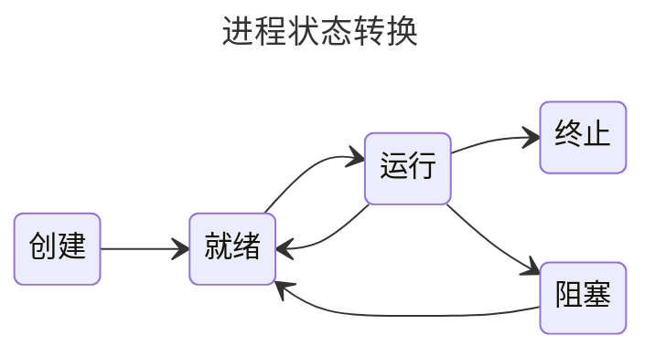

## 进程和线程

### 进程的概念和特征

#### 进程的概念

进程控制块（PCB）

程序段、相关数据段和PCB构成了进程实体（又称进程映像）

创建进程：创建进程实体的PCB
撤销进程：撤销进程的PCb

进程映像是静态的，进程是动态的

#### 进程的特征

1. 动态性
2. 并发性
3. 独立性
4. 异步性

#### 进程的状态与转换

1. 运行态
2. 就绪态
3. 阻塞态
4. 创建态
5. 终止态

就绪态与阻塞态的区别：就绪态进缺少处理器，只要获得处理机资源就立即执行；阻塞态是指需要其他资源（除了处理机）或等待某一事件（如I/O操作）。

运行态到阻塞态是主动行为。阻塞态到运行态是被动的行为
