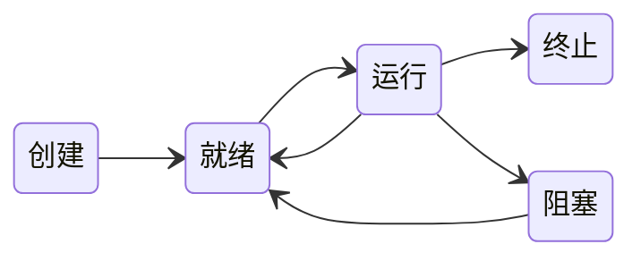

# 2. 进程与线程

## 进程与线程

### 进程的概念和特征

#### 进程的概念

进程控制块（PCB）

程序段、相关数据段和PCB构成了进程实体（又称进程映像）

创建进程：创建进程实体的PCB
撤销进程：撤销进程的PCB

进程映像是静态的，进程是动态的

> :heavy_exclamation_mark:PCB是进程存在的唯一标志

进程是进程实体的运行过程，是系统进行资源分配和调度的一个独立单位。

#### 进程的特征

1. 动态性
2. 并发性
3. 独立性
4. 异步性

### 进程的状态与转换

1. 运行态
2. 就绪态
3. 阻塞态
4. 创建态
5. 终止态

> 就绪态仅缺少处理器资源，而等待态需要其他资源或等待某一事件

就绪态与阻塞态的区别：就绪态进缺少处理器，只要获得处理机资源就立即执行；阻塞态是指需要其他资源（除了处理机）或等待某一事件（如I/O操作）。

运行态到阻塞态是主动行为。阻塞态到运行态是被动的行为

### 进程的组成

#### 进程控制块（PCB）

1. 进程描述信息
2. 进程控制和管理信息
3. 资源分配清单
4. 处理机相关信息

#### 程序段

能被进程调度程序调度到 CPU 执行的程序代码。可被多个程序共享

#### 数据段

进程的数据段，可以是原始数据，也可以是中间或最终结果

### 进程控制

**原语**：进程控制用的程序；执行期间不允许中断，不可分割的基本单位

#### 进程的创建

创建原语：

1. 为进程分配一个唯一的进程标识号
2. 为进程分配其运行所需的资源
3. 初始化 PCB
4. 若进程就绪队列能接纳新进程，则将新进程插入就绪队列，等待调度

#### 进程的终止

引发终止事件：

1. 正常结束
2. 异常结束
3. 外界干预

终止原语：

1. 根据进程标识符，检索出进程 PCB，读出进程状态
2. 若处于运行状态，立即终止进程的执行，将处理机资源分配给其他进程
3. 若该进程还有子孙进程，将其所有子孙进程终止
4. 将该进程所拥有的全部资源，或归还给其父进程，或归还给操作系统
5. 将该 PCB 从所在队列（链表）中删除

#### 进程的阻塞和唤醒

阻塞为进程自身的主动行为

阻塞原语：

1. 找到要被阻塞进程的标识号对应的 PCB
2. 若为运行态，保护其现场，将状态转为阻塞态，停止运行
3. 把该 PCB 插入相应事件的等待队列，将处理机资源给其他就绪进程

唤醒原语：

1. 在该事件的等待队列中找到相应进程的 PCB
2. 将其从等待队列中取出，并置其状态为就绪态
3. 把该 PCB 插入就绪队列，等待调度程序调度

### 进程的通信

#### 共享存储

甲乙之间有一个大布袋，只能从大布袋中交换物品，不能直接从各自手里抢夺

#### 消息传递

1. 直接通信方式：直接送达
2. 间接通信方式：信箱

#### 管道通信

按生产者-消费者方式进行通信

必须提供三方面协调能力：互斥、同步和确认对方的存在

### 线程和多线程模型

#### 线程的基本概念

基本的 CPU 执行单元，被系统独立调度和分配的基本单位

#### 线程与进程的比较

1. 调度
2. 并发性
3. 拥有资源
4. 独立性
5. 系统开销
6. 支持多处理机系统

#### 线程的属性

1. 轻型实体，不拥有系统资源
2. 不同线程可以执行相同程序
3. 同一进程中各个线程共享该进程所拥有的资源
4. 处理机的独立调度单位，多个线程可以并发执行
5. 创建后，便开始了生命周期

#### 线程的状态与转换

执行状态

就绪状态

阻塞状态

#### 线程的组织与控制

1. 线程控制块（TCB）
2. 线程的创建
3. 线程的终止：被终止后并不立即释放所占有的资源，当其他线程执行了分离函数后，才与资源分离

#### 线程的实现方式

##### 用户级线程

> 内核意识不到线程的存在，调度仍以进程为单位

优点：

1. 线程切换不需要切换到内核空间，节省开销
2. 调度算法可以是进程专用的，不同进程根据自身需要，选择不同的调度算法
3. 实现与操作系统无关，对线程的管理属于用户程序的一部分

缺点：

1. 线程执行系统调用时，所有线程都被阻塞
2. 不能发挥多处理机的优势，内核每次分配给进程的仅有一个 CPU，因此只有一个线程能执行

##### 内核级线程

> 线程管理的所有工作在内核空间内实现

优点：

1. 能发挥多处理机的优势，同时调度同一进程中的多个线程并行
2. 如果一个进程中线程被阻塞，内核可以调度该进程中的其他线程占用处理机，也可运行其他进程中的线程
3. 内核支持线程具有很小的数据结构和堆栈，线程切换比较快、开销小
4. 内核本身也可采用多线程技术，提高系统的执行速度和效率

缺点：同一进程内线程切换，需要从用户态转移到核心态，系统开销大

##### 组合方式

> 一些内核级线程对应多个用户级线程，用户级线程通过时分多路复用内核级线程实现

线程库实现方法：

1. 在用户空间提供一个没有内核支持的库。只导致用户空间中的本地函数调用。
2. 实现由操作系统直接支持的内核级的一个库。导致对内核的系统调用。

#### 多线程模型

1. 多对一模型：多个用户级线程映射到一个内核级线程

   优点：线程管理在用户空间进行，效率高

   缺点：阻塞问题；多个线程不能同时在多个处理机上运行

2. 一对一模型：每个用户级线程映射到一个内核级线程

   优点：并发能力强

   缺点：开销大

3. 多对多模型：n 个用户级线程映射到 m 个内核级线程，要求 n ≥ m

## 处理机调度

### 调度的概念

#### 调度的基本概念

#### 调度的层次

1. 高级调度（作业调度）

   分配内存、I/O 设备等，内存与辅存的调度，每个作业只调入一次，调出一次

   多道批处理系统大多配有，其他系统通常不需要

2. 中级调度（内存调度）

   提高内存利用率和系统吞吐量。实际上是存储器管理中的对换功能

3. 低级调度（进程调度）

#### 三级调度的联系

作业调度从外存的后备队列中选择一批作业进入内存，为它们建立进程，送入就绪队列，进程调度从就绪队列中选出一个进程，改为运行态，把 CPU 分配给他。中级调度是为了提高内存利用率，将暂时不能运行的进程挂起来

### 调度的目标

1. CPU利用率：运行时间/(运行时间+空闲时间)

2. 系统吞吐量：单位时间内系统完成作业的数量

3. 周转时间：完成时间 - 提交时间

   带权周转时间：作业周转时间/实际运行时间

4. 等待时间：衡量算法优劣，常常只需简单考察等待时间

5. 响应时间

### 调度的实现

#### 调度程序（调度器）

1. 排队器
2. 分派器
3. 上下文切换器

#### 调度的时机、切换与过程

不能进行进程调度与切换的情况：

1. 处理中断过程中
2. 进程在操作系统内核临界区中
3. 其他需要完全屏蔽中断的原子操作过程中

#### 进程调度方式

1. 非抢占调度方式（非剥夺式）
2. 抢占调度方式

#### 闲逛进程

> 优先级最低，没有就绪进程时才会运行闲逛进程

不需要 CPU 以外的资源，不会被阻塞

#### 两种线程的调度

1. 用户级线程调度
2. 内核级线程调度

### 典型的调度算法

#### 先来先服务（FCFS）调度算法

- 不可剥夺
- 不能作为分时系统和实时系统的主要调度策略
- 算法简单，效率低
- 对长作业有利，对短作业不利
- 有利于 CPU 繁忙型作业，不利于 I/O 繁忙型作业

#### 短作业优先（SJF）调度算法

- 对长作业不利（饥饿现象）
- 完全未考虑作业的急迫程度
- 根据用户提供的估计时间而定，不一定能真正做到短作业优先
- :star2:平均等待时间，平均周转时间最少

#### 优先级调度算法

1. 非抢占式优先级调度
2. 抢占式优先级调度

1. 静态优先级
2. 动态优先级

优先级参考原则：

1. 系统进程 > 用户进程
2. 交互性进程 > 非交互性进程（前台进程 > 后台进程）
3. I/O 型进程 > 计算型进程

#### 高响应比优先调度算法

$$
响应比 R_p = \frac{等待时间+要求服务时间}{要求服务时间}
$$

- 等待时间相同时，要求服务时间越短，响应比越高，有利于短作业，类似于 SJF
- 要求服务时间相同时，响应比由等待时间决定，等待时间越长，响应比越高，类似于 FCFS
- 对于长作业，响应比可随等待时间增加而提高，等待时间足够长时，也可获得处理机，克服了“饥饿”现象

#### 时间片轮转调度算法

主要适用于分时系统，剥夺式

时间片大小对系统性能影响很大

时间片长短决定因素：系统响应时间、就绪队列中的进程数量和系统处理能力

#### 多级队列调度算法

设置多个就绪队列，将不同类型或性质的进程固定分配到不同的就绪队列，每个队列实施不同的调度算法

#### 多级反馈队列调度算法

1. 设置多个就绪队列，每个队列赋予不同的优先级
2. 每个队列的进程运行时间片大小各不相同。优先级越高，时间片越小。
3. 每个队列采用 FCFS 算法。时间片内完成，则撤离，未完成，转入下一级队列
4. 按队列优先级调度，仅第1级队列为空时，才调度第2级队列

### 进程切换

#### 上下文切换

切换 CPU 到另一个进程需要保存当前进程状态并恢复另一个进程的状态；上下文是指某一时刻 CPU 寄存器和程序计数器的内容

流程：

1. 挂起一个进程，保存 CPU 上下文，包括程序计数器和其他寄存器
2. 更新 PCB 信息
3. 把进程的 PCB 移到相应的队列，如就绪、某事件阻塞等队列
4. 选择另一个进程执行，并更新其 PCB
5. 跳转到新进程 PCB 中的程序计数器所指向的位置执行
6. 恢复处理机上下文

#### 上下文切换的消耗

计算密集型，每秒几十上百次的切换中，每次切换需要纳秒量级时间

有些处理器提供多个寄存器组，上下文切换只需要简单改变当前寄存器组的指针

#### 上下文切换与模式切换

**模式切换**：用户态和内核态切换

上下文切换只能发生在内核态
