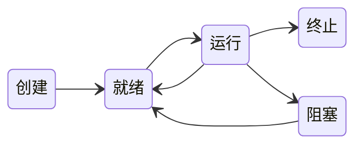

# 2. 进程与线程

## 进程与线程

### 进程的概念和特征

#### 进程的概念

进程控制块（PCB）

程序段、相关数据段和PCB构成了进程实体（又称进程映像）

创建进程：创建进程实体的PCB
撤销进程：撤销进程的PCB

进程映像是静态的，进程是动态的

> :bangbang:PCB是进程存在的唯一标志

#### 进程的特征

1. 动态性
2. 并发性
3. 独立性
4. 异步性

### 进程的状态与转换

1. 运行态
2. 就绪态
3. 阻塞态
4. 创建态
5. 终止态

> 就绪态仅缺少处理器资源，而等待态需要其他资源或等待某一事件

就绪态与阻塞态的区别：就绪态进缺少处理器，只要获得处理机资源就立即执行；阻塞态是指需要其他资源（除了处理机）或等待某一事件（如I/O操作）。

运行态到阻塞态是主动行为。阻塞态到运行态是被动的行为

### 进程的组成

#### 进程控制块

#### 程序段

#### 数据段

### 进程控制

#### 进程的创建

#### 进程的终止

#### 进程的阻塞和唤醒

### 进程的通信

#### 共享存储

#### 消息传递

1. 直接通信方式
2. 间接通信方式

#### 管道通信

### 线程和多线程模型

#### 线程的基本概念

#### 线程与进程的比较

#### 线程的属性

#### 线程的状态与转换

执行状态

就绪状态

阻塞状态

#### 线程的组织与控制

1. 线程控制块
2. 线程的创建
3. 线程的终止

#### 线程的实现方式

1. 用户级线程
2. 内核级线程
3. 组合方式

#### 多线程模型

1. 多对一模型
2. 一对一模型
3. 多对多模型

## 处理机调度

### 调度的概念

#### 调度的基本概念

#### 调度的层次

1. 高级调度
2. 中级调度
3. 低级调度

#### 三级调度的联系

### 调度的目标

1. CPU利用率
2. 系统吞吐量
3. 周转时间
4. 等待时机
5. 响应时间

### 调度的实现

#### 调度程序（调度器）

#### 调度的时机、切换与过程

#### 进程调度方式

#### 闲逛进程

#### 两种线程的调度

### 典型的调度算法

#### 先来先服务（FCFS）调度算法

#### 短作业优先（SJF）调度算法

#### 优先级调度算法

#### 高响应比优先调度算法

#### 时间片轮转调度算法

#### 多级队列调度算法

#### 多级反馈队列调度算法

### 进程切换
